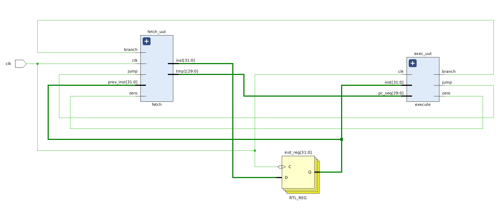
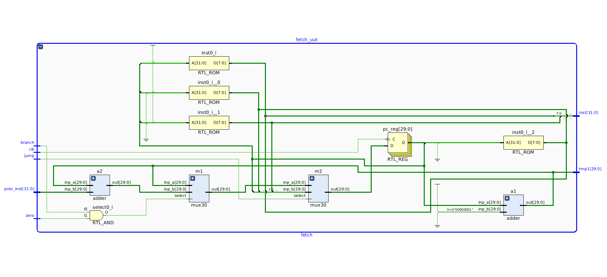
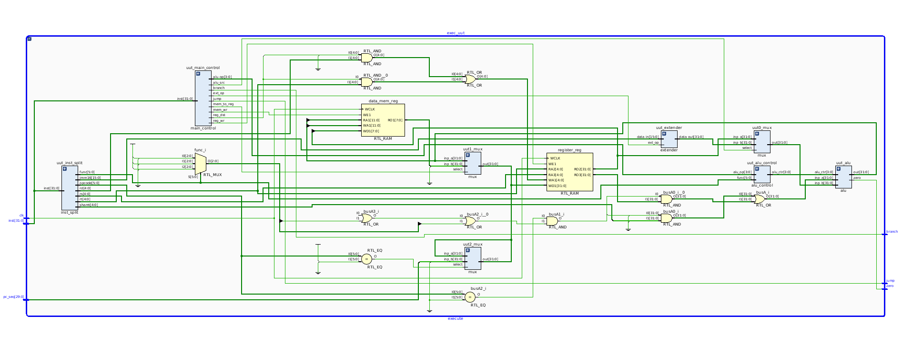

# 2-stage Pipelined MIPS Processor

## Architectural Diagrams:

#### 2-stage Pipelined Design:

#### Fetch Stage:

#### Decode/Execute Stage:

## Main Memory Design:

* It follows Little Endian type of storage policy.
* One memory block is of 1 byte.
* All read operations are asynchronous, all write operations are synchronous.
* There is separate Data Memory and Instruction Memory.
* Data Memory Size: 1024 bytes.
* Instruction Memory Size: 1024 bytes.

## Instructions Supported:

* ADD, SUB, ADDI, AND, ANDI, OR, ORI, XOR, XORI, NOR
* SLL, SLLV, SRA, SRAV, SRL, SRLV, SLT, SLTU, SLTI, SLTIU
* BEQ, BGTZ, BLEZ, BNE, J, JAL
* LB, SB

## Highlights

* The processor is designed in a modular way. That is, the codebase has each component as a separate module. This makes it easier to debug errors in existing code, as well as, add new features to the design.
* The above also makes the RTL of this project way more organised. Each functioning block can be seen as a different component.
* Number of Branch Delay Slots: 1
* Well formatted console logging for testing the working of processor.

## Assembler

* The assembler is present in the `assembler/` directory. It can convert the instructions which are supported to machine code. 

* Usage is simple: `python assembler.py <ASSEMBLY-CODE-FILE-PATH>` 

* It generates an output file with name `inst_mem.mem` which should be included as a memory file while simulation.
* The output machine code is in **LITTLE ENDIAN** format by default. To use **BIG ENDIAN** encoding, uncomment the lines 52-55 and comment out the lines 58-61.

## FOR TESTING:
* Edit the memory file `inst_mem.mem` which is the instruction memory.
* Make sure to use **LITTLE ENDIAN** encoding of instructions. In case you prefer **BIG ENDIAN** encoding, uncomment line 50 and comment out line 53 in file `fetch.v`.
* Uncomment the lines ending with `// FOR TESTING PURPOSE` to see testing outputs in the console.
* Use the console to see the output.
* A sample program with both its assembly code and machine code is present in the directory `sample-program/`. **NOTE:** The sample machine code is in BIG ENDIAN encoding.

---
